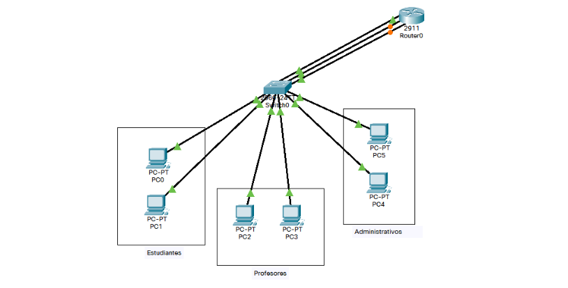
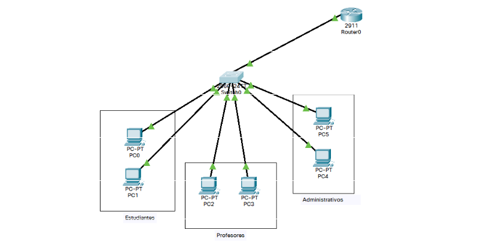
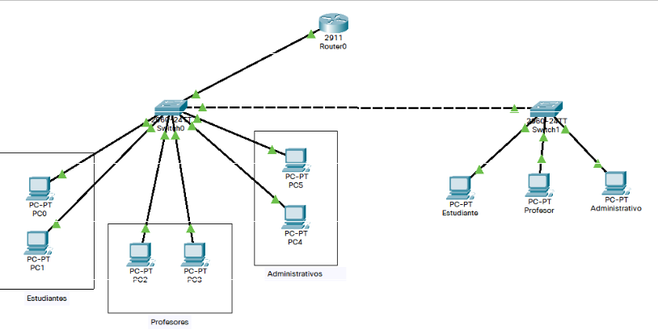

# Taller VLAN
Este taller tiene la finalidad de proporcionar un conocimiento sobre los diferentes elementos que componenen las VLAN, de tal manera que podamos hacer uso de las mismas implementado el software **cisco packet tracer** de tal manera que tengamos conceptos básicos sobre la creación de redes de computadoras.

## Campus universitario
Se considera la construcción de un campus universitario donde se implementan diferentes VLAN, las cuales nos permiten establecer conexión de diferentes equipos teniendo en cuenta la red en la que se encuentren

| **Descripción** | **VLAN** | **RED IP** | **DIR IP Gateway** | **Puertos** |
| --- | --- | --- | --- | --- |
| Estudiantes | 4 | 172.20.0.0/24 | 172.20.0.1 | 1-8 |
| Profesores | 5 | 172.20.1.0/24 | 172.20.1.1 | 9-16 |
| Administrativos | 6 | 172.20.2.0/24 | 172.20.2.1 | 17 - 22 | 

Se hace la propuesta de diferentes escenarios teniendo en cuenta diferentes elementos.

### Escenarios
1. Programación de las VLAN y router, conectando así un puerto de cada VLAN al router.
2. Conexión al router por medio de un único puerto físico como troncal y programar subinterfaces.
3. Ampliar la capacidad de puertos conexión en cascada de dos switches.

#### Escenario 1

#### Escenario 2

#### Escenario 3

